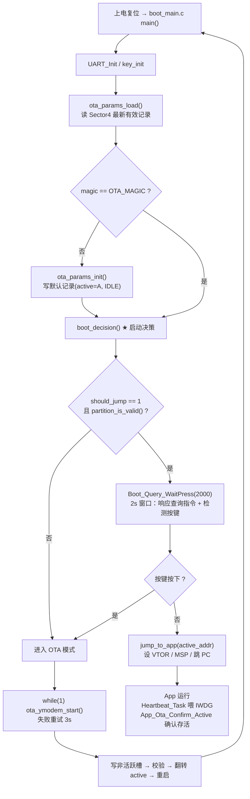
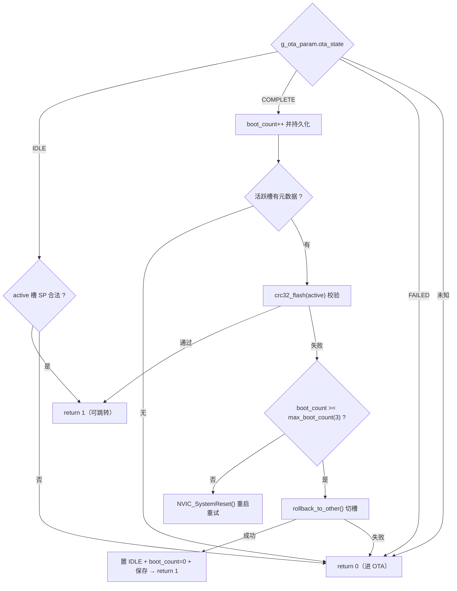
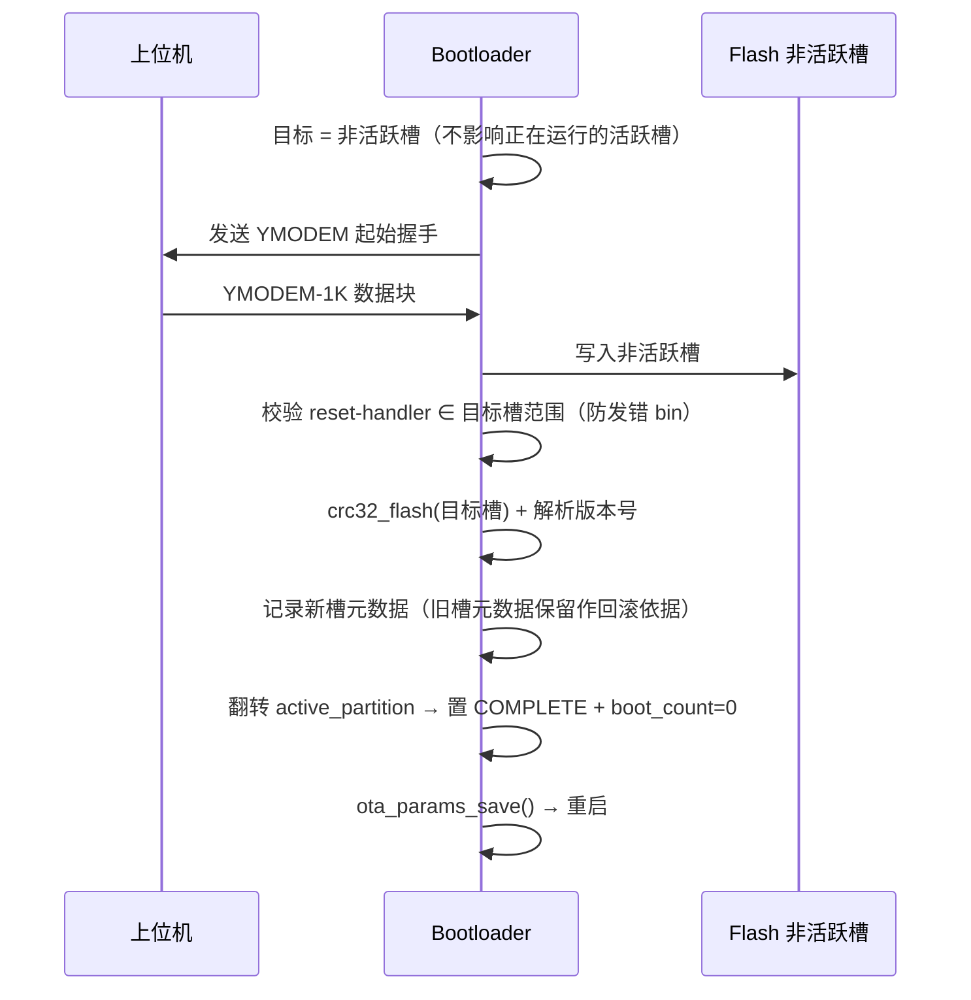

# Boot 流程梳理 — 显示域 ECU (STM32F429)

> 本文整理 Bootloader 的完整启动流程：分区布局、启动决策状态机、OTA 升级、真 AB 回滚闭环与掉电安全设计。
> 代码位于 `bootloader/` 目录；App 侧对接点见文末。

---

## 1. Flash 分区

| 地址 | 大小 | 内容 | 扇区 |
|---|---|---|---|
| `0x08000000` | 64KB | Bootloader | Sector 0–3 |
| `0x08010000` | 64KB | OTA 参数区（append-only 日志） | Sector 4 |
| `0x08020000` | 384KB | **App A 槽**（活跃/非活跃二选一） | Sector 5–7 |
| `0x08080000` | 384KB | **App B 槽**（活跃/非活跃二选一） | Sector 8–10 |
| `0x080E0000` | 128KB | 预留 | Sector 11 |

- 地址常量统一在 `bootloader/boot_config.h`。
- A/B 槽各链接一份独立镜像（`mdk/app.sct` → `0x08020000`，`mdk/app_b.sct` → `0x08080000`）。

---

## 2. 总流程图



---

## 3. 各模块职责

| 文件 | 职责 |
|---|---|
| `bootloader/boot_main.c` | 入口。仅流程编排：初始化 → 加载参数 → 决策 → 跳转/进 OTA。定义全局 `g_ota_param` |
| `bootloader/boot_decision.c` | **启动决策状态机**（核心）：按 `ota_state` 选址 / CRC 校验 / 切槽回滚 |
| `bootloader/boot_jump.c` | App 跳转：关中断 / 清 NVIC / 设 VTOR / 设 MSP / 跳 PC；`partition_is_valid()` 校验 SP |
| `bootloader/boot_wdg.h` | IWDG 寄存器直操作；跳转前启动、App 周期喂狗（约 16.4s 超时） |
| `bootloader/boot_query.c` | 芯片信息查询：2s 窗口内轮询响应 PC `[AA 55 01 00]` 指令 |
| `bootloader/ota.c` | OTA 升级：YMODEM 写非活跃槽 → 校验 → 翻转 active → 重启 |
| `bootloader/ota_params.c` | Sector4 参数读写：append-only 日志 + CRC32 校验，掉电安全 |
| `bootloader/flash_control.c` | Flash 底层：解锁/擦除/写入/拷贝的封装 |

---

## 4. 启动决策状态机（boot_decision）

`ota_state` 驱动，是回滚逻辑的核心：



### 关键设计点

1. **真 AB 回滚 = 切槽，零 Flash 搬运**：A/B 各存完整镜像，OTA 只写非活跃槽，旧固件原槽保留。回滚时 `rollback_to_other()` 仅翻转 `active_partition`。

2. **COMPLETE 状态不主动置 IDLE**：CRC 通过后**保持 COMPLETE 并返回 1**，把"确认存活"的责任交给 App。这覆盖「新固件启动即崩溃」的窗口——App 崩 → IWDG 复位回 boot → `boot_count` 再次递增 → 达 3 次即切槽回滚。

3. **boot_count 持久化**：每次进 COMPLETE 分支先 `boot_count++` 并 `ota_params_save()`，重启后计数延续。

---

## 5. App 跳转（jump_to_app）

标准 Cortex-M4 跳转序列：

```
校验 SP ∈ [0x20000000, 0x20030000)   ← 连续 192KB 主 SRAM
  → wdg_start()                        ← 启动 IWDG（约 16.4s 超时）
  → __disable_irq()
  → 停 SysTick
  → 清 8 组 NVIC ICER/ICPR（关中断 + 清挂起）
  → SCB->VTOR = app_addr（按 256 字节对齐）
  → __set_MSP(sp)
  → 跳转 entry = (void(*)(void))pc
```

`partition_is_valid()` 仅凭复位向量中的 SP 判断镜像是否合法（SP 落在主 SRAM 范围即视为有效）。

---

## 6. OTA 升级流程（ota_ymodem_start）



- 写入**非活跃槽**，正在运行的活跃槽不受影响。
- **防错包**：校验向量表 reset-handler 地址必须落在目标槽地址范围内，否则说明上位机发错 bin（如活跃 A 时发了 `app.bin` 而非 `app_b.bin`），不翻转、不重启。
- 失败：活跃槽不动，回到重试循环（3s 间隔）。

---

## 7. 回滚闭环（关键路径）

```
OTA 完成 → active 翻转 + ota_state=COMPLETE + boot_count=0 → 重启
  → boot 进 COMPLETE 分支：boot_count++ (1/3)
  → CRC32 校验活跃槽
       ├─ 通过 → jump_to_app（COMPLETE 保持）
       │        → App 初始化 + 任务创建全部成功
       │        → App_Ota_Confirm_Active(): COMPLETE→IDLE, boot_count=0  ← 闭环收敛
       │        → Heartbeat_Task 周期喂 IWDG
       │
       └─ App 启动崩溃/卡死未喂狗 → IWDG 复位(≤16.4s) 回 boot
            → 再进 COMPLETE：boot_count++ (2/3 → 3/3)
            → 达 max_boot_count(3) → rollback_to_other()
            → active 切回旧槽 + 置 IDLE + boot_count=0 → 跳旧固件
```

App 侧确认函数：`task/task_entry.c` 的 `App_Ota_Confirm_Active()`，在所有子系统初始化 + 任务创建完成后调用。它只改 `ota_state` / `boot_count`，**不碰 `active_partition`**（分区选择由 boot 唯一负责）。

---

## 8. 掉电安全设计（OTA 参数区）

Sector4 采用 **append-only 磨损均衡日志**：

- 1024 槽 × 64B，每条记录 = `magic(4) + seq(4) + ota_param_t(52) + crc(4)`。
- `save()` 顺序追加写下一空槽（无需每次擦除）；仅满 1024 槽才整扇区擦除重写（约 1/1024 频率）。
- **掉电安全**：单次 save 只写一条 64B 记录，写入中途掉电 → 该槽 CRC 不匹配 → `load()` 跳过取上一条有效记录。常规 save 完全掉电安全。
- 唯一窗口：日志满触发整扇区擦除时，擦除-重写之间掉电 → 退化为参数初始化、回滚默认 `active=A`，仍可安全启动。

`ota_params_load()` 始终返回 0，调用方靠 `magic` 判断有效性。

---

## 9. 与 App 侧的对接

| 对接点 | 文件 | 说明 |
|---|---|---|
| 参数读写共享 | `ota_params.c/h` + `flash_control.c/h` | boot 与 app 复用同一套 Sector4 读写，保证格式一致 |
| 确认存活 | `task/task_entry.c` `App_Ota_Confirm_Active()` | COMPLETE → IDLE，结束回滚观察窗口 |
| 喂狗 | `task/task_entry.c` `Heartbeat_Task()` | 每 500ms `wdg_feed()` |
| VTOR 自适配 | `app/main.c` | 用 `__Vectors` 符号动态获取槽位基址，A/B 通用 |

> App 直接烧录运行（不经 boot）时：IWDG 未启动，喂狗写 `KR=0xAAAA` 无副作用；`App_Ota_Confirm_Active()` 检测 magic 无效则直接 return。

---

## 10. 关键常量速查

| 常量 | 值 | 含义 |
|---|---|---|
| `OTA_MAGIC` | `0x4F544152` ("RATO") | 参数区魔数 |
| `MAX_BOOT_ATTEMPTS` | 3 | 最大启动尝试次数（回滚阈值） |
| `APP_A_ACTIVE` / `APP_B_ACTIVE` | 0 / 1 | 活跃分区标记 |
| `OTA_STATE_*` | IDLE=0 / RECEIVING=1 / VERIFY=2 / COMPLETE=3 / FAILED=4 | OTA 状态 |
| IWDG 超时 | 约 16.4s | LSI≈32kHz, PR=6(/256), RLR=2047 |
| YMODEM | 1K 块 / 3s 超时 / 10 次重试 | 传输参数 |
